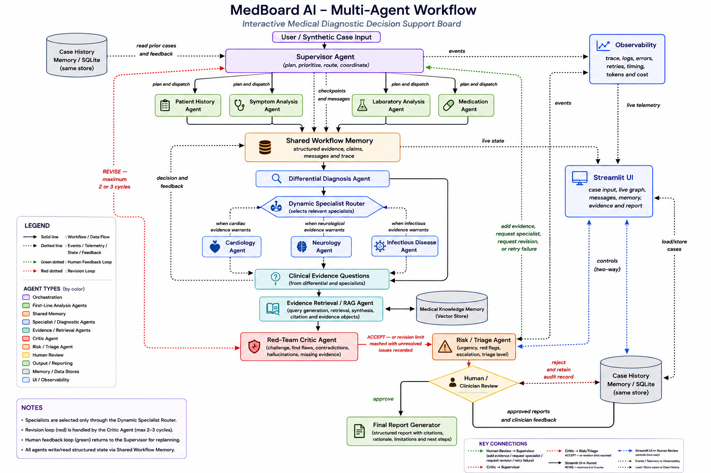
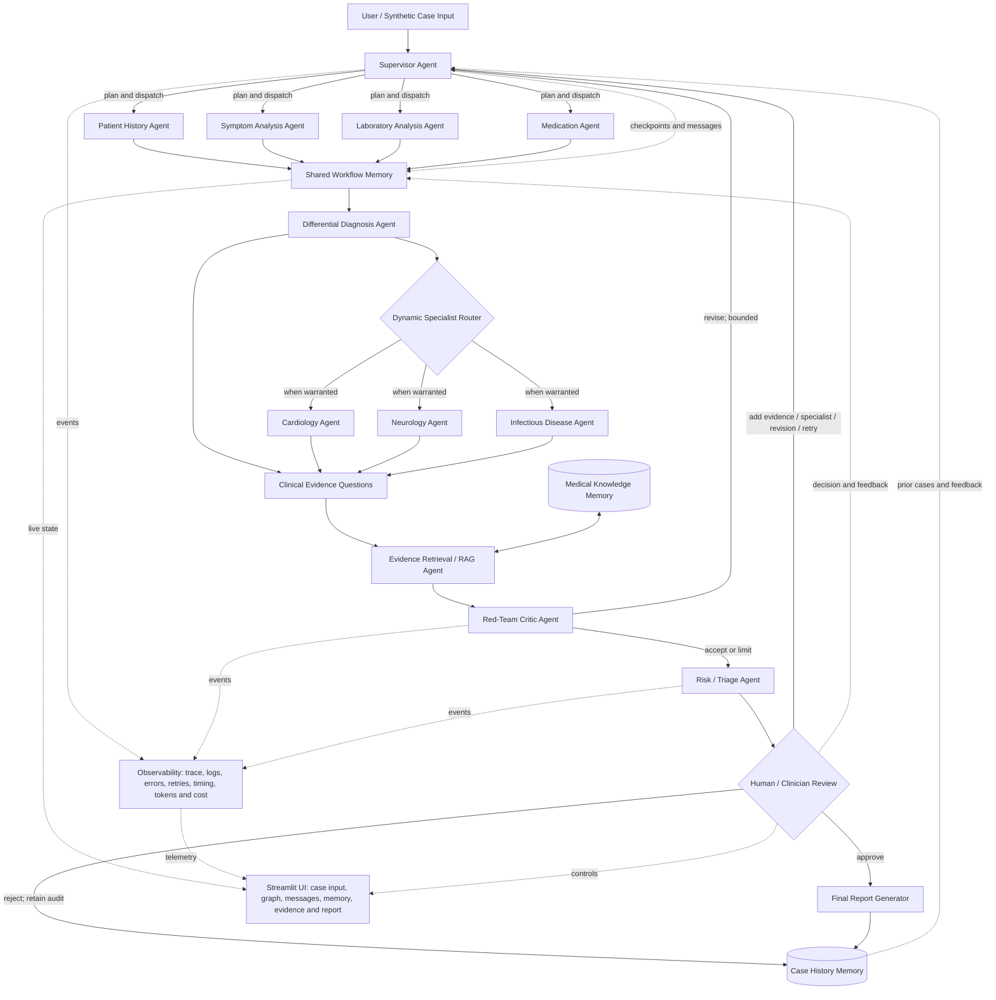

# MedBoard AI

An interactive multi-agent clinical reasoning board for education and human review.

MedBoard AI demonstrates how a supervised team of specialized agents can investigate a
synthetic case using structured evidence, conditional specialist routing, local retrieval,
red-team criticism, durable memory, and a real human approval checkpoint. It is not a
diagnostic service, autonomous doctor, or production medical device.



## Why multi-agent?

A single answer hides how evidence was gathered and challenged. MedBoard instead makes the
investigation observable: four intake agents work concurrently, a differential agent creates
competing considerations, only justified specialists run, RAG answers explicit evidence
questions, a critic can force bounded revision, and a clinician controls the final report.
Every cross-agent claim uses validated Pydantic contracts and stable evidence IDs.

## Architecture



The rendered application graph uses the same semantics. Workflow checkpoints, the Chroma
knowledge index, and SQLite case history are separate stores. Final report generation is
reachable only after explicit human approval.

## Agent team

| Agent | Responsibility |
| --- | --- |
| Supervisor | Plans, dispatches, routes, and coordinates recovery |
| History, Symptom, Laboratory, Medication | Independently extract structured evidence |
| Differential | Produces multiple ranked considerations and missing evidence |
| Specialist Router | Selects one, several, or no specialists from evidence |
| Cardiology, Neurology, Infectious Disease | Support, challenge, and request information |
| Evidence Retrieval | Searches local source-attributed clinical material |
| Red-Team Critic | Tests unsupported claims and triggers bounded revision |
| Risk / Triage | Applies transparent urgency rules without diagnosing |
| Human Review | Approves, rejects, adds evidence, revises, routes, or retries |
| Report Generator | Creates the disclaimer-bearing report after approval |

## Technology

- Python 3.11+, Pydantic, LangGraph, and Streamlit
- SQLite for checkpoints and auditable case history
- ChromaDB with deterministic local embeddings for offline RAG
- OpenAI/Gemini configuration boundary plus a deterministic demo provider
- Pytest, coverage, mypy, Flake8, and reproducible evaluation artifacts

## Quick start

```powershell
python -m venv .venv
.venv\Scripts\Activate.ps1
python -m pip install --upgrade pip
python -m pip install -e ".[workflow,providers,dev]"
Copy-Item .env.example .env
streamlit run app.py
```

The default `DEMO_MODE=true` requires no API key or network connection. Use only synthetic,
public benchmark, or appropriately de-identified inputs.

## Configuration

Configuration is environment-driven; see [.env.example](.env.example).

| Variable | Purpose | Default |
| --- | --- | --- |
| `DEMO_MODE` | Use deterministic offline provider | `true` |
| `LLM_PROVIDER` | Provider selection (`openai` or `gemini`) | `openai` |
| `OPENAI_API_KEY`, `OPENAI_MODEL` | OpenAI live-mode credentials/model | empty |
| `GOOGLE_API_KEY`, `GEMINI_MODEL` | Gemini live-mode credentials/model | empty |
| `MAX_REVISIONS` | Critic revision bound | `2` |
| `MAX_AGENT_RETRIES` | Configured retry limit | `2` |
| `RAG_TOP_K` | Retrieval result limit | `5` |
| `DATABASE_PATH` | Durable case-history SQLite path | `data/medboard.db` |
| `WORKFLOW_CHECKPOINT_PATH` | LangGraph checkpoint SQLite path | `data/workflow_checkpoints.db` |

Live-provider execution is intentionally not enabled in the current prototype; the provider
configuration contract is ready, while all verified demos use the same graph through the
offline provider.

## Run and present

Launch the dashboard:

```powershell
streamlit run app.py
```

Run a concise CLI investigation:

```powershell
python -m medboard.cli --case data/demo_cases/neurological.json
```

The five bundled cases cover anemia, cardiac, infectious, neurological, and routine paths.
For a presentation walkthrough, use [docs/DEMO_SCRIPT.md](docs/DEMO_SCRIPT.md).

## Screenshots and visual assets

The architecture image above is the polished presentation visual. The live dashboard provides
the rendered execution graph, operational metrics, agent-state cards, evidence, messages,
trace, memory, logs, settings, human controls, and final report. Application screenshots
should be captured from the running local dashboard so persisted run identifiers and case
state are authentic rather than mocked.

## RAG and evidence provenance

Documents under `data/knowledge` contain title, organization, year, source URL, and document
type metadata. Ingestion creates heading-aware chunks and local embeddings. Each retrieval
retains its question ID, chunk ID, document, organization, section, excerpt, similarity, and
public URL. The Knowledge Base page makes these sources inspectable.

## Evaluation

```powershell
python -m medboard.evaluation --output evaluation/results
```

The deterministic benchmark measures differential Top-1/3/5 recall, routing precision and
recall, red-flag behavior, triage, missing-information recall, unsupported claims, resource
usage, RAG Recall@K, MRR, and citation completeness. It compares a single-pass proxy,
multi-agent workflow without critic, and full MedBoard. See
[evaluation/README.md](evaluation/README.md) and the checked-in
[results](evaluation/results/evaluation_results.md). These small synthetic benchmarks test
software behavior, not clinical efficacy.

## Quality checks

```powershell
python -m medboard
flake8 medboard tests app.py
mypy medboard
pytest --cov=medboard
python -m pip check
```

## Repository map

```text
app.py                    Streamlit entry point
medboard/agents/          Specialized agents and human actions
medboard/graph/           State, reducers, routing, and LangGraph workflows
medboard/memory/          Checkpoint and case-history persistence
medboard/rag/             Knowledge ingestion, embeddings, and retrieval
medboard/evaluation/      Metrics, ablations, report generation, CLI
medboard/ui/              Dashboard views and controls
data/demo_cases/          Reproducible synthetic cases
data/benchmarks/          Versioned benchmark labels and RAG questions
data/knowledge/           Curated public educational summaries
docs/                     Architecture notes, screenshots, and demo script
evaluation/results/       Reproducible baseline results
tests/                    Unit, integration, persistence, UI, and evaluation tests
```

## Safety and limitations

- The system offers differential considerations, never definitive diagnoses or prescriptions.
- Deterministic demo behavior is deliberately repeatable and is not clinical validation.
- The small benchmark cannot establish generalization, accuracy, or real-world safety.
- Local logs, databases, checkpoints, vector indexes, `.env`, credentials, and patient data
  are ignored by Git and must not be committed.
- Every final report states:

> This output is generated by an experimental AI clinical decision-support system and
> requires review by a qualified healthcare professional.

## Future work

- Implement and validate live OpenAI/Gemini structured providers.
- Add externally reviewed benchmark cases, repeated trials, and clinician-led error analysis.
- Add validated retry/timeout policies and similar-case retrieval as secondary evidence.
- Export clinician-approved reports and audit bundles in privacy-preserving formats.
