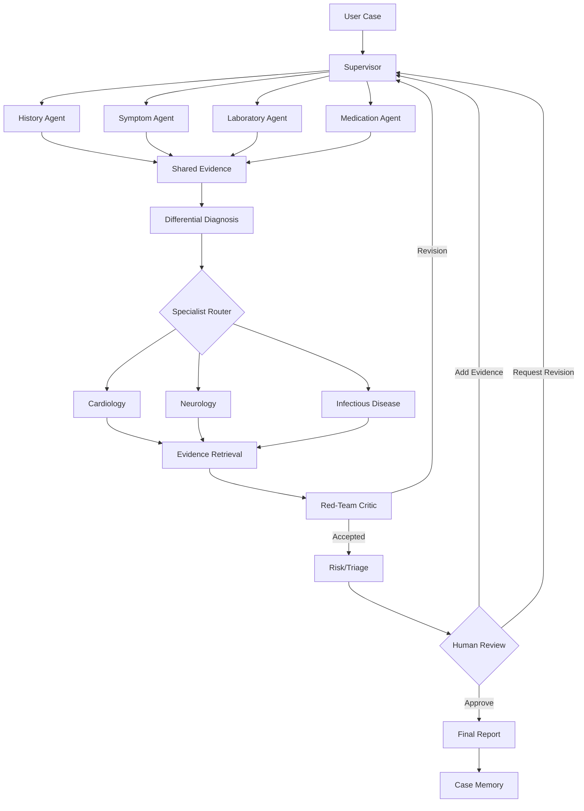

# Codex Master Implementation Prompt — MedBoard AI

You are acting as a **senior AI systems architect, LangGraph engineer, backend engineer, frontend engineer, ML engineer, QA engineer, and technical writer**.

Your task is to design and implement a complete university project called:

# MedBoard AI

## Interactive Multi-Agent Medical Diagnostic Decision Support Board

The project must demonstrate a **real multi-agent AI workforce**, not a chatbot and not a simple sequential chain of LLM calls.

The system should simulate a **multidisciplinary clinical case-review board** where multiple AI agents independently examine different aspects of a case, communicate evidence, disagree when appropriate, request missing information, challenge hypotheses, and collaboratively generate a structured case analysis for **human clinician review**.

---

# 1. Critical Safety Scope

This system is strictly:

* an educational system;
* a clinical reasoning demonstration;
* a medical decision-support prototype;
* a university multi-agent AI project.

It is **NOT**:

* an autonomous doctor;
* a replacement for clinicians;
* a system that gives patients definitive diagnoses;
* a system that autonomously prescribes treatment;
* a production medical device.

Never display language such as:

> "You definitely have disease X."

Instead use language such as:

> "Disease X is one of the differential considerations based on the available evidence."

Every final report must clearly state:

> "This output is generated by an experimental AI clinical decision-support system and requires review by a qualified healthcare professional."

For the university demonstration, prioritize:

* synthetic patient cases;
* publicly available benchmark cases;
* de-identified datasets.

Do not require real patient data.

---

# 2. Assignment Objectives

The application must clearly demonstrate all of the following:

1. Supervisor Agent
2. At least 6 specialized agents
3. Agent-to-agent communication
4. Planning and reasoning
5. Shared memory
6. Long-term memory
7. RAG / knowledge retrieval
8. Tool integration
9. Dynamic agent routing
10. Human-in-the-loop
11. Interactive Streamlit UI
12. Execution graph
13. Live agent trace
14. Agent communication history
15. Token usage
16. API cost estimation
17. Logging
18. Error handling
19. Retry mechanisms
20. Memory viewer
21. Final report viewer
22. Reproducible demo cases
23. Evaluation framework

The most important objective is demonstrating that the agents **collaborate to solve a problem that cannot sensibly be reduced to one LLM prompt**.

---

# 3. Core System Philosophy

Do NOT implement this architecture:

```text
User
 ↓
Agent 1
 ↓
Agent 2
 ↓
Agent 3
 ↓
Final Answer
```

That is a pipeline disguised as multi-agent AI.

Implement this instead:

```text
                         USER CASE
                             |
                             v
                       SUPERVISOR
                             |
           +-----------------+-----------------+
           |                 |                 |
           v                 v                 v
        HISTORY           SYMPTOM             LAB
           |                 |                 |
           +----------- SHARED EVIDENCE ------+
                             |
                             v
                DIFFERENTIAL DIAGNOSIS
                             |
                  dynamic specialist routing
                             |
              +--------------+-------------+
              |              |             |
              v              v             v
          CARDIOLOGY      NEUROLOGY     INFECTIOUS
              |              |             |
              +--------------+-------------+
                             |
                             v
                      EVIDENCE / RAG
                             |
                             v
                     RED-TEAM CRITIC
                             |
                  +----------+----------+
                  |                     |
               ACCEPT                REVISE
                  |                     |
                  v                     |
             RISK / TRIAGE              |
                  |                     |
                  +---------------------+
                             |
                             v
                      HUMAN REVIEW
                             |
                +------------+-----------+
                |            |           |
             APPROVE      ADD INFO     REJECT
                |            |           |
                v            |           |
          FINAL REPORT <------+-----------+
                |
                v
           CASE MEMORY
```

Agents must operate on **structured evidence**, not just free-form text.

---

# 4. Technology Stack

Use the following unless there is a strong technical reason not to.

## Core

* Python 3.11+
* LangGraph
* LangChain where useful
* Pydantic
* Streamlit

## LLM providers

Provide a provider abstraction supporting:

* OpenAI
* Google Gemini

Configuration must be through environment variables.

Example:

```text
LLM_PROVIDER=openai
OPENAI_API_KEY=
OPENAI_MODEL=

GOOGLE_API_KEY=
GEMINI_MODEL=
```

Do not hard-code model names throughout the code.

Create a central LLM configuration layer.

---

# 5. Persistence

Use:

* SQLite for project simplicity
* ChromaDB or FAISS for local RAG
* LangGraph state/checkpointing where appropriate

SQLite is preferred unless PostgreSQL becomes necessary.

The project must be runnable locally without cloud infrastructure except the selected LLM API.

---

# 6. Keep the Repository Manageable

Do not create an enterprise microservice architecture.

Use approximately:

```text
medboard-ai/
│
├── app.py
├── config.py
├── requirements.txt
├── .env.example
├── README.md
│
├── agents/
│   ├── base.py
│   ├── supervisor.py
│   ├── history.py
│   ├── symptoms.py
│   ├── laboratory.py
│   ├── medication.py
│   ├── differential.py
│   ├── specialists.py
│   ├── evidence.py
│   ├── critic.py
│   ├── risk.py
│   └── reporter.py
│
├── graph/
│   ├── state.py
│   ├── workflow.py
│   └── routing.py
│
├── tools/
│   ├── rag.py
│   ├── medical_rules.py
│   ├── calculators.py
│   └── validation.py
│
├── memory/
│   ├── database.py
│   ├── case_memory.py
│   └── knowledge_store.py
│
├── observability/
│   ├── logger.py
│   ├── token_tracker.py
│   └── trace.py
│
├── ui/
│   ├── dashboard.py
│   ├── case_input.py
│   ├── workflow_view.py
│   ├── trace_view.py
│   ├── memory_view.py
│   └── report_view.py
│
├── data/
│   ├── knowledge/
│   ├── demo_cases/
│   └── medboard.db
│
├── logs/
│
└── tests/
```

If fewer files make the project cleaner, simplify further.

Do not create unnecessary abstraction layers.

---

# 7. Central LangGraph State

This is extremely important.

All agents should collaborate through a structured shared state.

Create something conceptually similar to:

```python
class MedicalCaseState(TypedDict):
    run_id: str

    case_input: dict
    normalized_case: dict

    supervisor_plan: dict

    history_findings: dict
    symptom_findings: dict
    laboratory_findings: dict
    medication_findings: dict

    evidence: list
    contradictions: list
    missing_information: list

    differential_diagnoses: list

    selected_specialists: list
    specialist_opinions: list

    retrieved_evidence: list

    critic_review: dict

    triage_result: dict

    revision_count: int

    human_status: str
    human_feedback: str | None

    final_report: dict | None

    agent_messages: list

    errors: list
    execution_trace: list

    token_usage: dict
    estimated_cost: float
```

Use Pydantic models wherever appropriate.

Do not allow random dictionaries with unpredictable output when structured models are possible.

---

# 8. Common Agent Output Format

Each analytical agent should return a structured result.

Example:

```json
{
  "agent": "cardiology_agent",
  "status": "completed",
  "summary": "Cardiac causes remain clinically relevant.",
  "claims": [
    {
      "claim": "Acute coronary syndrome should remain in the differential.",
      "supporting_evidence": [
        "chest discomfort",
        "shortness of breath"
      ],
      "contradicting_evidence": [],
      "confidence": 0.71
    }
  ],
  "missing_information": [
    "ECG",
    "troponin",
    "blood pressure"
  ],
  "questions_for_other_agents": [],
  "warnings": []
}
```

This is critical.

Agents must exchange **claims, evidence, contradictions and questions**, not just paragraphs.

---

# 9. Agent Communication Model

Implement a structured communication object.

Example:

```python
class AgentMessage(BaseModel):
    sender: str
    recipient: str
    message_type: Literal[
        "claim",
        "challenge",
        "request",
        "response",
        "warning",
        "revision"
    ]
    content: str
    evidence_ids: list[str]
    timestamp: datetime
```

Example communication:

```text
Cardiology Agent → Supervisor
TYPE: claim

"Cardiac pathology should remain high-priority."
```

Then:

```text
Red-Team Agent → Cardiology Agent
TYPE: challenge

"Your assessment does not sufficiently address pulmonary embolism."
```

Then:

```text
Supervisor → Risk Agent
TYPE: request

"Evaluate whether current findings indicate urgent escalation."
```

The communication log must appear in Streamlit.

---

# 10. Agent 1 — Supervisor Agent

The Supervisor is the most important agent.

It must not just call all agents.

Responsibilities:

* understand the case;
* determine required analysis;
* create an investigation plan;
* decide which agents should execute;
* decide parallel vs sequential execution;
* inspect agent outputs;
* detect disagreement;
* request additional analysis;
* choose specialist agents;
* trigger critic;
* request revision;
* pause for human input;
* recover from agent failure.

Example plan:

```json
{
  "case_category": [
    "cardiovascular",
    "respiratory"
  ],
  "initial_agents": [
    "history",
    "symptoms",
    "laboratory",
    "medication"
  ],
  "specialists": [
    "cardiology"
  ],
  "priority": "high",
  "reasoning": "Chest discomfort and dyspnea justify cardiac evaluation."
}
```

Dynamic routing is mandatory.

Example:

```text
Case:
Headache + confusion + unilateral weakness

Supervisor calls:

History
Symptoms
Laboratory
Neurology
Risk

Supervisor should NOT automatically call:
Cardiology
Infectious Disease
```

Another case:

```text
Fever + cough + inflammatory markers

Supervisor may call:
History
Symptoms
Laboratory
Medication
Infectious Disease

Potentially respiratory specialist later.
```

---

# 11. Agent 2 — Patient History Agent

Responsibilities:

Extract and normalize:

* age;
* biological sex if provided;
* chief complaint;
* symptom onset;
* duration;
* progression;
* previous illnesses;
* previous operations;
* allergies;
* medications;
* family history;
* smoking;
* alcohol;
* occupation;
* travel;
* relevant exposures;
* pregnancy status if relevant and supplied;
* other contextual factors.

Output:

```json
{
  "key_history": [],
  "risk_factors": [],
  "negative_findings": [],
  "missing_history": [],
  "possible_relevance": []
}
```

This agent should identify missing history instead of inventing it.

---

# 12. Agent 3 — Symptom Analysis Agent

Responsibilities:

Normalize symptom descriptions.

Example:

```text
"my heart is racing"
```

may map to:

```text
palpitations
```

Analyze:

* onset;
* severity;
* duration;
* associated symptoms;
* systems involved;
* red-flag symptom combinations.

Return:

```json
{
  "normalized_symptoms": [],
  "symptom_clusters": [],
  "possible_systems": [],
  "red_flags": [],
  "missing_symptom_information": []
}
```

---

# 13. Agent 4 — Laboratory Analysis Agent

The lab agent should combine deterministic logic and LLM explanation.

Do NOT ask an LLM to calculate everything.

Implement a lab-reference tool.

Example data:

```json
{
  "hemoglobin": {
    "value": 9.1,
    "unit": "g/dL"
  },
  "wbc": {
    "value": 15000,
    "unit": "/uL"
  }
}
```

Agent output:

```json
{
  "abnormal_values": [],
  "important_patterns": [],
  "potential_implications": [],
  "missing_tests": [],
  "data_quality_warnings": []
}
```

The tool should recognize unit mismatch or obviously invalid values.

Never silently assume units.

---

# 14. Agent 5 — Medication Agent

Responsibilities:

Analyze supplied medications for:

* common adverse effects;
* symptom relevance;
* potential interactions;
* duplicate medication classes;
* possible contraindication concerns;
* medication-induced explanations.

Do not prescribe medication.

Do not autonomously recommend dose changes.

Output should focus on:

```text
"Medication X could potentially contribute to symptom Y and should be reviewed by a clinician."
```

---

# 15. Agent 6 — Differential Diagnosis Agent

This agent integrates evidence from:

* history;
* symptoms;
* laboratory;
* medications.

It must generate **multiple competing hypotheses**.

Never just return one diagnosis.

Example:

```json
[
  {
    "hypothesis": "iron-deficiency anemia",
    "support": [
      "fatigue",
      "low hemoglobin"
    ],
    "against": [],
    "confidence": 0.68,
    "missing_evidence": [
      "ferritin",
      "MCV"
    ]
  }
]
```

Confidence values are AI reasoning scores, **not validated clinical probabilities**.

Make this distinction visible in the UI.

---

# 16. Specialist Routing

Initially implement:

1. Cardiology Agent
2. Neurology Agent
3. Infectious Disease Agent

Design the architecture so additional specialists can later be added.

Possible future agents:

* Endocrinology
* Gastroenterology
* Hematology
* Respiratory Medicine
* Nephrology

But do NOT implement all of them initially.

---

# 17. Cardiology Agent

Focus on:

* cardiovascular explanations;
* chest symptoms;
* dyspnea;
* palpitations;
* cardiovascular risk factors;
* cardiovascular-related test requirements;
* critical cardiac red flags.

Must challenge diagnoses when appropriate.

---

# 18. Neurology Agent

Focus on:

* focal neurological symptoms;
* headache;
* seizures;
* weakness;
* confusion;
* sensory changes;
* altered consciousness;
* neurological emergencies.

---

# 19. Infectious Disease Agent

Focus on:

* fever;
* infection exposure;
* inflammatory markers;
* travel;
* contagious symptoms;
* systemic infection patterns.

---

# 20. Specialist Output Format

Each specialist should return:

```json
{
  "specialist": "cardiology",
  "assessment": "",
  "supported_hypotheses": [],
  "challenged_hypotheses": [],
  "alternative_hypotheses": [],
  "required_information": [],
  "critical_concerns": [],
  "confidence": 0.0
}
```

---

# 21. Evidence Retrieval Agent — RAG

Implement actual retrieval.

Do NOT fake RAG by placing static text in the system prompt.

Workflow:

```text
Agent clinical question
        ↓
Query generation
        ↓
Vector search
        ↓
Top-k documents
        ↓
Relevant chunks
        ↓
LLM interpretation
        ↓
Evidence object
```

Every retrieval result should include:

```json
{
  "document": "",
  "source": "",
  "section": "",
  "retrieved_text": "",
  "similarity_score": 0.0
}
```

Keep excerpts concise.

Knowledge sources should be:

* legally usable;
* publicly accessible;
* educational or guideline-oriented;
* stored with metadata.

Do not ingest random low-quality medical blogs.

---

# 22. RAG Document Processing

Implement ingestion:

```text
PDF/TXT/Markdown
        ↓
text extraction
        ↓
cleaning
        ↓
chunking
        ↓
embedding
        ↓
vector database
```

Metadata:

```json
{
  "title": "",
  "organization": "",
  "year": "",
  "source_url": "",
  "document_type": ""
}
```

Allow the Streamlit interface to inspect retrieved chunks.

---

# 23. Red-Team Critic Agent

This agent is essential.

It should aggressively attempt to falsify the leading conclusions.

Responsibilities:

* identify premature closure;
* identify overlooked diagnoses;
* find contradictions;
* detect weak evidence;
* identify hallucinated assumptions;
* identify unsupported confidence;
* check whether agents ignored important evidence;
* request new specialist review;
* request missing information;
* determine whether revision is required.

Output:

```json
{
  "decision": "accept | revise",
  "problems": [],
  "overlooked_hypotheses": [],
  "unsupported_claims": [],
  "missing_evidence": [],
  "questions": [],
  "severity": "low | medium | high"
}
```

---

# 24. Critic Revision Loop

Implement:

```text
Differential
      ↓
Specialists
      ↓
Critic
      ↓
Is revision needed?
    /       \
  yes       no
   |         |
   v         v
Supervisor  Risk Agent
   |
Re-plan
   |
Relevant agent
   |
Updated differential
   |
Critic again
```

Maximum revision count:

```text
2 or 3
```

Prevent infinite loops.

If the maximum is reached:

```text
Supervisor records unresolved disagreement and proceeds to human review.
```

---

# 25. Risk / Triage Agent

This agent must not make the final diagnosis.

Its role is to detect **urgency and red flags**.

Possible output:

```json
{
  "triage_level": "routine | priority | urgent | emergency",
  "red_flags": [],
  "reasoning": "",
  "recommended_escalation": ""
}
```

Make the interface visually highlight urgent states.

For demonstration, use deterministic emergency rules for major red flags where practical instead of relying entirely on the LLM.

---

# 26. Missing Information Engine

This should become one of the project's key innovation features.

Each agent may request missing information.

Aggregate requests such as:

```text
Ferritin
ECG
Troponin
Duration of symptoms
Medication history
Travel exposure
```

Rank missing information using:

```text
Diagnostic utility
+
Urgency
+
Number of agents requesting it
```

Example:

```text
Highest-value missing information:

1. ECG
Requested by:
- Cardiology
- Risk Agent

Reason:
May distinguish urgent cardiac pathology.

2. Troponin
Requested by:
- Cardiology
```

The Supervisor can pause execution and ask the human to provide information.

---

# 27. Human-in-the-Loop

Human review must be implemented as an actual graph interruption/checkpoint if feasible.

Possible statuses:

```text
WAITING_FOR_HUMAN
APPROVED
REJECTED
MORE_INFORMATION
REQUEST_REVISION
```

UI controls:

```text
Approve Report
Request Revision
Add Information
Request Specialist
Retry Failed Agent
Reject Analysis
```

Example:

```text
Human adds:

Ferritin = 6 ng/mL
```

Workflow:

```text
New data
   ↓
Lab Agent reruns
   ↓
Differential updated
   ↓
Relevant specialist reruns
   ↓
Critic reviews again
```

Do NOT rerun the entire system unnecessarily.

---

# 28. Final Report Agent

Generate a structured report.

Format:

# MedBoard AI Case Review

## Case Summary

## Key Findings

## Differential Considerations

### 1. Hypothesis A

Supporting evidence:

Contradicting evidence:

AI reasoning confidence:

Missing evidence:

### 2. Hypothesis B

...

## Specialist Opinions

## Retrieved Evidence

## Areas of Disagreement

## Missing Information

## Risk / Triage Assessment

## Suggested Clinical Review Priorities

## Human Review Status

## Disclaimer

Do not output direct prescriptions.

---

# 29. Memory Architecture

Use three memory layers.

## A. Workflow Memory

Temporary case-specific state inside LangGraph.

Contains:

* current evidence;
* agent messages;
* hypotheses;
* specialist requests;
* human decisions;
* errors;
* status.

## B. Knowledge Memory

RAG/vector database containing medical references.

## C. Case History Memory

SQLite database storing previous executions.

Suggested tables:

```text
cases
runs
agent_executions
agent_messages
hypotheses
human_feedback
retrievals
errors
```

---

# 30. Case Database

Example case table:

```text
id
created_at
case_title
age
sex
case_json
status
final_report
```

Agent execution:

```text
id
run_id
agent_name
started_at
ended_at
duration_ms
status
input_json
output_json
model
input_tokens
output_tokens
estimated_cost
error
```

Agent messages:

```text
id
run_id
sender
recipient
message_type
content
timestamp
```

---

# 31. Long-Term Learning / Feedback

For the first working release, do NOT implement autonomous model retraining.

Instead store human feedback.

Example:

```text
Final clinician/user evaluation:
Correct leading differential
Partially correct
Incorrect
Incomplete
```

Optional:

```text
Confirmed diagnosis:
...
```

This allows retrospective evaluation.

---

# 32. Reliability Tracking

Optional but high-value feature:

Calculate agent performance over test/demo cases.

Dashboard:

```text
Agent                  Agreement/Accuracy
History Agent               94%
Lab Agent                   96%
Differential Agent          78%
Cardiology                   81%
Neurology                    76%
```

Do not show meaningless accuracy if no ground truth exists.

Only calculate metrics on labeled benchmark cases.

---

# 33. Tool Integration

Agents should not all be pure LLMs.

Use deterministic tools.

Possible tools:

## LabReferenceTool

Input:

```text
test
value
unit
age/sex if relevant
```

Output:

```text
status
reference
warning
```

## RiskRuleTool

Detect predefined emergency red flags.

## MedicalCalculatorTool

Only add useful validated calculators if appropriate for demo cases.

Do NOT add 30 random calculators.

## RAGSearchTool

Search knowledge documents.

## CaseMemoryTool

Retrieve similar previous cases for demonstration.

---

# 34. Optional Similar-Case Retrieval

A useful innovation:

```text
Current case
    ↓
Case embedding
    ↓
Previous case database
    ↓
Retrieve similar cases
```

Output:

```text
Similar historical case:
Case 17

Similarity:
0.84

Previous confirmed result:
...

Important:
Historical similarity does not determine diagnosis.
```

This should be secondary evidence, not the deciding factor.

---

# 35. Streamlit UI

The UI must feel like an **AI operations dashboard**, not a chat page.

Use a professional layout.

---

# 36. Main Sidebar

Include:

```text
MedBoard AI

New Case
Saved Cases
Knowledge Base
System Logs
Settings
```

Settings:

```text
LLM provider
Model
Temperature
Maximum critic iterations
RAG top-k
Debug mode
```

---

# 37. Case Input Page

Fields:

```text
Case title

Age
Sex

Chief complaint

Symptoms

Symptom duration

Medical history

Current medications

Allergies

Family history

Lifestyle

Laboratory results

Additional notes
```

Allow structured lab rows:

```text
Test | Value | Unit
```

Button:

```text
START MULTI-AGENT REVIEW
```

---

# 38. Dashboard Top Metrics

After execution starts:

```text
Run ID

Status

Active Agent

Completed Agents

Total Execution Time

LLM Calls

Tool Calls

Tokens

Estimated Cost
```

---

# 39. Agent Status Panel

Example:

```text
Supervisor              ✅ Complete
History Agent            ✅ Complete
Symptom Agent            ✅ Complete
Laboratory Agent         ✅ Complete
Medication Agent         ✅ Complete
Differential Agent       ✅ Complete
Cardiology Agent         🟢 Running
Neurology Agent          ⏭ Not Selected
Infectious Agent         ⏭ Not Selected
Evidence Agent           ⏳ Waiting
Red-Team Critic          ⏳ Waiting
Risk Agent               ⏳ Waiting
Report Agent             ⏳ Waiting
```

Make "Not Selected" visible.

That proves dynamic routing.

---

# 40. Workflow Graph

Display the LangGraph workflow.

Highlight:

* completed nodes;
* current node;
* pending nodes;
* failed nodes;
* skipped nodes.

If live graph coloring is difficult, provide a clean static Mermaid/Graphviz graph and a separate state table.

Do not spend days on unnecessary animation.

---

# 41. Execution Trace

Example:

```text
01:05:32 Supervisor started.

01:05:33 Supervisor classified case as:
cardiovascular + respiratory.

01:05:33 Parallel dispatch:
→ History
→ Symptoms
→ Laboratory
→ Medication

01:05:38 History completed.

01:05:39 Laboratory completed.
Abnormal values: 2

01:05:41 Differential generated 4 hypotheses.

01:05:42 Supervisor requested:
Cardiology Agent

01:05:48 Cardiology challenged hypothesis #3.

01:05:49 Evidence Agent retrieved 4 passages.

01:05:54 Red-Team requested revision.

01:05:55 Supervisor rerouted to Differential Agent.

01:06:00 Revision accepted.

01:06:02 Risk Agent:
urgent review

01:06:03 Execution paused for human approval.
```

---

# 42. Agent Communication Panel

Show cards or chronological messages.

Example:

```text
CARDIOLOGY → SUPERVISOR
Challenge

"The current differential underweights cardiac pathology."
```

```text
RED TEAM → DIFFERENTIAL
Revision Request

"Hypothesis #1 does not explain finding X."
```

```text
SUPERVISOR → LAB
Request

"Reassess anemia pattern based on the specialist feedback."
```

---

# 43. Differential Diagnosis Panel

Display:

```text
Hypothesis              AI Score    Evidence    Missing
--------------------------------------------------------
Condition A               0.74         4           2
Condition B               0.51         3           3
Condition C               0.33         2           1
```

Label:

> "AI reasoning score — not a validated clinical probability."

---

# 44. Disagreement Viewer

This feature will make the project stand out.

Example:

```text
DISAGREEMENT DETECTED

Cardiology Agent:
Supports Hypothesis A

Infectious Disease Agent:
Supports Hypothesis B

Red-Team Agent:
Neither sufficiently explains Finding C

Supervisor Action:
Request additional laboratory evidence
```

---

# 45. Missing Information Viewer

Example:

```text
Missing Information

HIGH VALUE

ECG
Requested by:
Cardiology, Risk

Ferritin
Requested by:
Lab, Differential

Travel history
Requested by:
Infectious Disease
```

Button:

```text
ADD INFORMATION
```

---

# 46. RAG Viewer

Display:

```text
Agent query

Retrieved source

Document title

Relevant passage

Similarity score

Used by which agent
```

Do not hide RAG behind the system.

Expose it in the UI because it earns demonstration marks.

---

# 47. Human Review Page

Display:

```text
HUMAN REVIEW REQUIRED

Triage:
URGENT

Leading differential considerations:
...

Unresolved disagreements:
...

Missing information:
...
```

Controls:

```text
APPROVE REPORT

ADD INFORMATION

REQUEST REVISION

REQUEST SPECIALIST

REJECT
```

---

# 48. Observability

Create a unified tracing system.

Every event:

```json
{
  "event_id": "",
  "run_id": "",
  "timestamp": "",
  "type": "agent_started",
  "agent": "laboratory_agent",
  "metadata": {}
}
```

Possible events:

```text
run_started
agent_started
agent_completed
agent_failed
tool_called
tool_completed
message_sent
routing_decision
critic_revision
human_interrupt
human_resume
run_completed
```

---

# 49. Token Tracking

For each LLM call record:

```text
model
input tokens
output tokens
total tokens
estimated cost
```

Global totals:

```text
Run tokens:
18,432

Estimated cost:
$0.0xx
```

Create model pricing configuration separately so it can be updated without changing agent logic.

If exact token usage is unavailable from a provider, clearly mark it as estimated.

---

# 50. Error Handling

Implement errors intentionally and cleanly.

Examples:

## LLM API failure

```text
Call
 ↓
Failure
 ↓
Retry 1
 ↓
Retry 2
 ↓
Fallback / mark agent unavailable
 ↓
Supervisor decides whether workflow can continue
```

## RAG failure

```text
Vector DB unavailable

Evidence Agent output:
"External evidence retrieval unavailable."

Supervisor continues but final report flags:
"Evidence retrieval incomplete."
```

## Agent output validation failure

```text
LLM returns malformed output
 ↓
Pydantic validation fails
 ↓
format repair retry
 ↓
failure logged
```

---

# 51. Retry Policy

Something like:

```text
max retries = 2

retry delay:
1 second
2 seconds
```

Do not retry infinitely.

---

# 52. Partial Failure

Important feature:

If Medication Agent fails:

```text
Supervisor should not automatically terminate entire case.
```

Instead:

```text
Medication analysis unavailable.

Continue with:
History
Symptoms
Lab
Differential

Report limitation.
```

This demonstrates resilient orchestration.

---

# 53. Demo Cases

Create at least 5 synthetic demonstration cases.

Do not create only trivial cases.

## Demo Case 1 — Anemia-like presentation

Features:

```text
fatigue
dizziness
palpitations
pallor
low hemoglobin
```

Purpose:

* Lab Agent involvement
* Cardiology alternative
* missing ferritin
* differential reasoning

## Demo Case 2 — Acute chest symptoms

Features:

```text
chest discomfort
shortness of breath
sweating
nausea
```

Purpose:

* Cardiology
* emergency triage
* critic checking alternative explanations
* human escalation

## Demo Case 3 — Neurological presentation

Features:

```text
weakness
speech difficulty
confusion
```

Purpose:

* dynamic Neurology routing
* emergency risk escalation

## Demo Case 4 — Infectious presentation

Features:

```text
fever
cough
high WBC
high CRP
```

Purpose:

* Infectious Disease routing
* RAG
* competing respiratory/non-infectious hypotheses

## Demo Case 5 — Ambiguous multi-system case

Create a case intentionally producing disagreement.

Purpose:

* multiple specialists;
* Red-Team;
* missing-information loop;
* human interaction.

---

# 54. Best Presentation Demo

Design one flagship case where agents genuinely disagree.

Example flow:

```text
USER
submits ambiguous case

↓

SUPERVISOR
plans investigation

↓

HISTORY + SYMPTOM + LAB + MEDICATION
run in parallel

↓

DIFFERENTIAL AGENT
generates 4 hypotheses

↓

SUPERVISOR
selects Cardiology and Infectious Disease

↓

CARDIOLOGY
supports hypothesis A

↓

INFECTIOUS DISEASE
supports hypothesis B

↓

RAG AGENT
retrieves evidence

↓

RED TEAM
says both agents ignored finding X

↓

SUPERVISOR
requests Lab Agent reassessment

↓

DIFFERENTIAL
updates ranking

↓

RISK
detects urgent concern

↓

SYSTEM PAUSES

↓

HUMAN
adds test result

↓

RELEVANT AGENTS RERUN

↓

RED TEAM
accepts

↓

HUMAN APPROVES

↓

FINAL REPORT
```

This should be the centerpiece of the live presentation.

---

# 55. Evaluation Framework

The project needs evaluation beyond "it looks cool."

Use labeled/synthetic cases where expected outcomes are known.

Evaluate different capabilities separately.

---

# 56. Differential Recall

If benchmark diagnosis is:

```text
Condition A
```

measure whether Condition A appears in:

```text
Top-1
Top-3
Top-5
```

Metrics:

```text
Top-1 accuracy
Top-3 recall
Top-5 recall
```

---

# 57. Routing Accuracy

For each test case define expected specialists.

Example:

```text
Expected:
Neurology

Selected:
Neurology

Correct.
```

Evaluate:

```text
specialist routing precision
specialist routing recall
```

---

# 58. Red-Flag Detection

Create cases containing known red flags.

Measure:

```text
red-flag recall
false alarms
```

---

# 59. Missing Information Detection

Create cases intentionally missing important evidence.

Expected:

```text
ECG
ferritin
troponin
etc.
```

Evaluate whether the system requests it.

---

# 60. RAG Evaluation

Use a small question set.

Measure:

```text
Was relevant source retrieved?
Was source correctly cited?
Did the answer use retrieved evidence?
```

Possible metrics:

```text
Recall@K
MRR
```

Do not create unnecessarily complicated research evaluation unless useful.

---

# 61. Multi-Agent Ablation Study

This could significantly strengthen the academic side.

Compare:

## Configuration A

Single LLM:

```text
Case → LLM → Report
```

## Configuration B

Multi-agent without critic

## Configuration C

Full MedBoard:

```text
multi-agent
+
specialists
+
RAG
+
critic
```

Compare:

```text
Top-3 differential recall
red-flag detection
missing-information detection
unsupported claims
```

This demonstrates whether the multi-agent architecture actually adds value.

---

# 62. Critic Ablation

Compare:

```text
without Red-Team

vs

with Red-Team
```

Measure:

```text
unsupported claims
missed contradictions
revisions
diagnostic recall
```

This is much stronger academically than just showing architecture diagrams.

---

# 63. Supervisor Ablation

Compare:

```text
Call every specialist
```

versus:

```text
Dynamic Supervisor routing
```

Measure:

```text
LLM calls
tokens
cost
execution time
routing quality
```

Potential finding:

```text
Dynamic routing reduces calls while preserving analysis quality.
```

This directly justifies having the Supervisor Agent.

---

# 64. Concurrency

Where practical:

```text
History
Symptoms
Lab
Medication
```

should run concurrently because they are initially independent.

After aggregation:

```text
specialists
```

may also run concurrently.

Do not force sequential execution if unnecessary.

Record timing so the demo can show:

```text
Sequential estimated time:
40 sec

Parallel execution:
18 sec
```

if supported by actual measurements.

---

# 65. Prompt Engineering

Each agent needs:

* identity;
* objective;
* allowed responsibilities;
* prohibited behavior;
* required output structure;
* access to shared evidence;
* explicit instruction not to fabricate missing facts;
* request for uncertainty.

Example principle:

```text
If information is unavailable, explicitly mark it as missing.
Never assume a test result, symptom, medication, or history item that was not supplied.
```

---

# 66. Specialist Independence

Avoid leaking the final differential too strongly into every specialist.

A specialist should inspect:

```text
case evidence
+
current hypotheses
```

but still be allowed to introduce alternatives.

Require:

```text
Supported hypotheses
Challenged hypotheses
Alternative hypotheses
```

---

# 67. Confidence Handling

Do not allow agents to casually produce "99% certainty."

Use confidence categories internally or constrain numeric estimates.

Possible:

```text
Low
Moderate
High
```

Or:

```text
0.0–1.0 reasoning score
```

Always label numeric values as:

```text
AI reasoning confidence
```

not:

```text
medical probability
```

---

# 68. Contradiction Detection

Create a utility that examines claims such as:

```text
Agent A:
"Finding X strongly supports hypothesis Y."

Agent B:
"Finding X argues against hypothesis Y."
```

Record:

```json
{
  "topic": "Finding X",
  "agent_a": "",
  "agent_b": "",
  "type": "contradiction",
  "resolved": false
}
```

Supervisor should decide:

```text
request evidence
request another specialist
leave disagreement unresolved
```

---

# 69. Evidence Objects

Use IDs.

Example:

```json
{
  "evidence_id": "EV-024",
  "type": "lab",
  "name": "hemoglobin",
  "value": "9.1 g/dL",
  "source": "user_case",
  "confidence": 1.0
}
```

Agent claims reference evidence IDs:

```json
{
  "claim": "...",
  "evidence_ids": [
    "EV-024",
    "EV-030"
  ]
}
```

This makes agent reasoning auditable.

---

# 70. Traceability

Final report claims should ideally be traceable to:

```text
claim
 ↓
agent
 ↓
evidence
 ↓
source
```

Example UI:

```text
Possible anemia

Why?

→ Low hemoglobin [EV-024]
→ Fatigue [EV-006]
→ Pallor [EV-009]

Suggested by:
Differential Agent

Supported by:
Lab Agent
```

This is much stronger than opaque AI output.

---

# 71. Security and Privacy

Basic requirements:

* never log API keys;
* `.env` must be in `.gitignore`;
* sanitize uploaded filenames;
* avoid storing unnecessary personally identifying information;
* clearly mark demo cases as synthetic;
* allow case deletion;
* avoid sending hidden local knowledge documents unnecessarily.

---

# 72. Logging

Use Python logging plus structured JSON logs.

Example:

```json
{
  "timestamp": "...",
  "level": "INFO",
  "run_id": "...",
  "agent": "cardiology",
  "event": "agent_completed",
  "duration_ms": 2831
}
```

Keep human-readable logs too.

---

# 73. Testing Strategy

Implement real tests.

## Unit tests

Test:

```text
state validation
lab value parsing
routing functions
database writes
RAG retrieval
cost calculation
message creation
```

## Agent tests

Use mocked LLM outputs.

Verify schemas.

## Workflow tests

Test:

```text
normal completion
critic revision
human interruption
agent failure
RAG failure
maximum revision reached
```

---

# 74. Offline / Mock Mode

This is extremely important for demonstrations.

Implement:

```text
DEMO_MODE=true
```

When enabled:

* use predictable agent responses for bundled demo cases;
* avoid needing all API calls;
* preserve workflow behavior;
* still show traces and messages.

This protects the class presentation from:

* internet failure;
* quota exhaustion;
* API outage;
* unpredictable model output.

Do not make demo mode fake the whole application. It should simulate model responses through the same graph.

---

# 75. API Mode

When:

```text
DEMO_MODE=false
```

use actual configured LLM provider.

Show clearly in UI:

```text
MODE:
LIVE LLM
```

or:

```text
MODE:
DEMO
```

---

# 76. README

Create a high-quality README containing:

```text
Project overview
Problem statement
Why multi-agent?
Architecture diagram
Agent descriptions
Workflow
Technology stack
Setup
Environment variables
How to run
RAG setup
Demo cases
Evaluation
Safety limitations
Screenshots
Folder structure
Future work
```

---

# 77. Architecture Documentation

Include Mermaid:



---

# 78. UI Requirement Mapping

Ensure the assignment requirements are explicitly visible:

| Assignment Requirement | MedBoard Feature                 |
| ---------------------- | -------------------------------- |
| Supervisor             | Supervisor Agent                 |
| 6+ Agents              | 10+ meaningful agents            |
| Collaboration          | claim/challenge/request messages |
| Shared Memory          | LangGraph state                  |
| Knowledge Base         | RAG vector database              |
| Tool Integration       | lab tools, RAG, DB               |
| UI                     | Streamlit                        |
| Live Agent Trace       | execution timeline               |
| Communication History  | message viewer                   |
| Execution Graph        | LangGraph visualization          |
| Token/Cost             | observability panel              |
| Logs                   | logging viewer                   |
| Error Reports          | failure viewer                   |
| Memory Viewer          | workflow/case/RAG viewer         |
| Pause/Resume           | HITL interrupt                   |
| Approve/Retry          | human controls                   |
| Final Output           | report viewer                    |

---

# 79. Project Milestones

Implement incrementally.

## Milestone 1 — Skeleton

Deliver:

```text
Streamlit loads
LangGraph loads
State model works
Supervisor works
4 base agents work
Execution trace visible
```

Do not touch fancy UI yet.

---

## Milestone 2 — Genuine Collaboration

Deliver:

```text
Differential Agent
Specialist router
Cardiology
Neurology
Infectious Disease
Agent messages
Structured claims
```

Test actual disagreement.

---

## Milestone 3 — Critic Loop

Deliver:

```text
Red-Team
contradictions
revision
maximum iteration protection
```

---

## Milestone 4 — Human-in-the-Loop

Deliver:

```text
pause
approve
add information
resume
```

---

## Milestone 5 — RAG

Deliver:

```text
document ingestion
embeddings
retrieval
citation metadata
UI evidence viewer
```

---

## Milestone 6 — Persistence

Deliver:

```text
SQLite
cases
runs
agent logs
messages
human feedback
```

---

## Milestone 7 — Observability

Deliver:

```text
token tracking
cost estimation
execution time
tool call counts
retry/error logs
```

---

## Milestone 8 — Evaluation

Deliver:

```text
demo cases
benchmark cases
metrics
ablation scripts
results
```

---

## Milestone 9 — Polish

Deliver:

```text
UI improvement
README
screenshots
architecture
demo script
clean GitHub repository
```

---

# 80. Definition of "Done"

Do not consider the project finished merely because:

```text
python app.py
```

runs.

The project is complete only when this scenario works:

1. User selects a demo case.
2. Supervisor creates a plan.
3. Several agents run.
4. Some execute in parallel.
5. Shared state updates.
6. Differential diagnoses are generated.
7. Supervisor dynamically selects relevant specialists.
8. Specialists exchange structured evidence.
9. RAG retrieves supporting material.
10. Critic challenges the result.
11. At least one case triggers revision.
12. Risk Agent evaluates urgency.
13. Workflow pauses.
14. Human adds information or requests revision.
15. Workflow resumes.
16. Updated analysis is generated.
17. Human approves.
18. Final report appears.
19. Execution trace is visible.
20. Agent messages are visible.
21. Token/cost information appears.
22. Logs can be inspected.
23. Case is stored in memory.
24. Previous case can be opened later.

---

# 81. Things You Must NOT Do

Do not:

* implement every agent as identical LLM wrapper;
* call every specialist on every case;
* use one giant prompt pretending to be multiple agents;
* fake agent messages;
* fake RAG;
* hard-code final diagnoses into production mode;
* produce real prescriptions;
* silently invent missing information;
* let critic loop forever;
* create 50 unnecessary files;
* add Kubernetes;
* add Docker Compose with seven services unless genuinely required;
* add microservices;
* add real hospital integrations;
* add FHIR infrastructure unless time remains after the actual assignment is complete;
* build authentication before core functionality;
* spend excessive effort on CSS before agent collaboration works;
* add 20 specialists just to increase the agent count.

A smaller functioning system with genuine collaboration is better than a huge broken architecture.

---

# 82. Development Strategy for Codex

Do not attempt to generate the entire project in one giant uncontrolled edit.

Work iteratively.

For every milestone:

1. Inspect existing repository.
2. State what will be implemented.
3. Implement the smallest coherent version.
4. Run relevant tests.
5. Fix failures.
6. Run the application if practical.
7. Summarize completed work.
8. Update TODO/status documentation.
9. Continue to the next milestone.

Never assume code works without running it.

---

# 83. First Task

Start by:

1. Inspecting the current repository.
2. Creating a concise implementation checklist.
3. Creating the minimal project structure.
4. Implementing configuration.
5. Defining all central Pydantic/state models.
6. Implementing the LangGraph state.
7. Implementing a base agent interface.
8. Implementing Supervisor Agent.
9. Implementing History Agent.
10. Implementing Symptom Agent.
11. Implementing Laboratory Agent.
12. Implementing Medication Agent.
13. Connecting these agents through LangGraph.
14. Creating one synthetic case.
15. Running it from the command line.
16. Printing a structured execution trace.

Do NOT build the full Streamlit interface until this first workflow is verified.

After completing this milestone, report:

```text
FILES CREATED/MODIFIED

WHAT WORKS

TEST RESULTS

CURRENT GRAPH

KNOWN LIMITATIONS

NEXT MILESTONE
```

Then continue development systematically.

---

# 84. Expected Final Character of the Project

The finished application should feel like this:

> "A team of AI clinical reasoning agents is investigating a case under the control of a Supervisor."

It should NOT feel like:

> "I entered symptoms and ChatGPT gave me an answer."

The user should visibly observe:

```text
investigation
→ delegation
→ evidence gathering
→ disagreement
→ specialist consultation
→ retrieval
→ criticism
→ revision
→ risk analysis
→ human decision
→ final report
```

That observable collaborative process is the primary product.

---

# 85. Final Quality Priority

If trade-offs are required, prioritize in this order:

1. Correct multi-agent architecture
2. Supervisor routing
3. Meaningful agent specialization
4. Agent-to-agent communication
5. Critic/revision loop
6. Human-in-the-loop
7. Shared state and memory
8. Tool usage
9. RAG
10. Observability
11. Reliable demo
12. Evaluation
13. UI polish
14. Additional features

Do not sacrifice the first six items to add flashy secondary functionality.

Build **MedBoard AI as a genuine collaborative multi-agent decision-support system**, not as a collection of named prompts.
